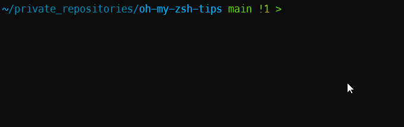
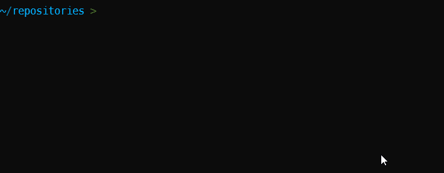
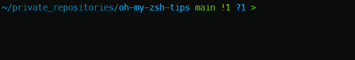

# Oh-my-zsh


## Some advantages over bash {#some-advantages}

### General

* There are plenty of plugins and themes to enhance the bash experience (see below)
* Spell correct: type a command like  `cd myFolder` (an existing one) but make a typo like `cd myfolder` or `cd myFoder` or anything else. Zsh will detect it and will suggest something like *Did you mean cd myFolder?*. To make this work, run `nano ~/.zshrc` and make sure to enable `ENABLE_CORRECTION` to true (uncomment the line) and write a new line like `export SPROMPT="You've typed %R, did you mean %r? [Yes, No, Abort, Edit] "` to customize the question as you want. *Run `source ~/.zshrc` to read the new configuration file if you've modified it.*
* There is a special utility called `zmv` that will allow mass actions on files or folders like renaming `.tmp` files to `.bak` f.i. `zmv -n '(*).tmp' '${1}.bak'`.
* Completion is provided with the `-` (minus sign) and after pressing the <kbd>tab</kbd> key. For instance, type `git commit -` or `docker-compose logs -` then press <kbd>
* Chain commands with:
    * `;` like in `clear ; ls` (run the first then the second)
    * `||` like in `rm -rf node_modules/ || rm package-lock.json || yarn install` (`||` will exec the next command only if the previous one was successful)
    * `|` to pipe the output like in `cat longfile.log | less` (similar to the `PAUSE` DOS command)
* Special search patterns like:
  * `ls *(.x)` display the list of all executable files in the current folder
  * `ls */*(.x)` display the list of all executable files in a first-level subfolder
  * `ls **/*(.x)` display the list of all executable files, whatever the deep in the structure
  * `ls -d */**(/)` list of all folders and subfolders (not deeper)

### Navigating

* The *autopushd* command helps you do `popd` after you use cd to go back to your previous directory: type f.i. `cd /usr/local/bin` to go there then type `popd` and you're back in your origin folder. `-` (the minus sign) is an alias of `popd`
* Run `mkdir` and `cd` in only one action: `take test/any/sub/folders` will create the folder and jump in it (`take` is a function defined in `~/.oh-my-zsh/lib/functions.zsh`; we can create our owns)
* You've a subfolder called `vendor`? No need to type `cd vendor`, `cd` is implicit; just type `vendor` and press <kbd>Enter</kbd> to jump inside
* Inline glob expansion: type f.i. `cat */**/settings.json` **AND PRESS <kdb>TAB</kdb>** (not <kbd>enter</kbd>!), zsh will replace the pattern with all matched filenames. The cat instruction will then be something like `cat settings.json vendor/laravel/tinker/settings.json vendor/vlucas/phpdotenv/settings.json` (and many more perhaps). Before pressing <kbd>Enter</kbd>, you can navigate in the command and suppress a few filenames f.i.
* Prompt completion: type `cd` followed by <kbd>enter</kbd> and you'll get the list of folders; you can select a name by navigating with the <kbd>tab</kbd> key
* Type `cd ven` and press <kbd>tab</kbd>, Zsh will complete the folder name
* Type `cd /u/lo/b` and press <kbd>tab</kbd>, the path will be extended to `cd /usr/local/bin` because there is no doubt on the desired path. This is called the *fuzzy match* feature
* Thanks to global aliases, type `cd ...` to go up two levels (the parent folder of the parent folder), `cd .....` for three levels up (equivalent of `cd ../../..`)

### History

* Type any command like `mkdir` followed by a space and press the <kbd>UP</kbd> or <kbd>DOWN</kbd> key to loop across the history.
* Type `cd sto` and Zsh will display a command you've already used (like `cd storage/app/public/pictures`); just press the right arrow key and hop, the command will be completed so you just need to press <kbd>enter</kbd> to run it
* Shared history: open more than one Zsh sessions, the history will be shared across all sessions
* <kbd>ALT</kbd>-<kbd>/</kbd> to output the full CLI history
* <kbd>CTRL</kbd>-<kbd>R</kbd> to show the list of commands in the history with navigation feature so we can select a previous command and press <kbd>Enter</kbd> to fire it

### Not Zsh specific

* Press <kbd>CTRL</kbd>-<kbd>L</kbd> to clear the screen (note: `clear` will clear the output history i.e. if we scroll to the first line, we'll not have previous commands while this is untrue with <kbd>CTRL</kbd>-<kbd>L</kbd>)

## Install zsh and oh-my-zsh

1. First, install zsh like this: `sudo apt install zsh`.
2. Then set zsh as your default shell: `chsh -s /usr/bin/zsh`
3. This done, install oh-my-zsh: `sh -c "$(curl -fsSL https://raw.github.com/ohmyzsh/ohmyzsh/master/tools/install.sh)"`

### Install plugins

> [https://github.com/ohmyzsh/ohmyzsh/tree/master/plugins](https://github.com/ohmyzsh/ohmyzsh/tree/master/plugins)

Note: each time a plugin has to be activated, you'll need to edit the `~/.zshrc` file and add his name to the list of plugins to load.

Edit the file and search for the `plugins=( ... )` array. Add the plugin name to the list. Save the file and the plugin will be loaded the next time you'll create a session.

#### core plugins

With core plugins, no installation are required since they're already there. We just need to activate them by adding their name in the `plugins=( ... )` array.

##### composer

> [https://github.com/ohmyzsh/ohmyzsh/tree/master/plugins/composer](https://github.com/ohmyzsh/ohmyzsh/tree/master/plugins/composer)

Add aliases for `composer`. For instance type `cu` instead of `composer update`.

##### docker-compose

> [https://github.com/ohmyzsh/ohmyzsh/tree/master/plugins/docker-compose](https://github.com/ohmyzsh/ohmyzsh/tree/master/plugins/docker-compose)

Add aliases for `docker-compose` like f.i. `dce` instead of `docker-compose exec`.

##### git

> [https://github.com/ohmyzsh/ohmyzsh/tree/master/plugins/git](https://github.com/ohmyzsh/ohmyzsh/tree/master/plugins/git)

Add aliases for `git` like f.i. `gst` instead of `git status`.

##### globalias

> [https://github.com/ohmyzsh/ohmyzsh/tree/master/plugins/globalias](https://github.com/ohmyzsh/ohmyzsh/tree/master/plugins/globalias)

This one is a special one: you'll type any alias like `dce` then press the space bar and that alias will be expanded so you'll see what is behind (here, `docker-compose exec`). I like this because expanding an alias will allow you to always remember the real command behind, see it and don't have any doubt about "Uh oh, I don't remember well what was the real command".

Example below with `la` followed by a space and expanded to `ls -lAh`:



#### zsh-autosuggestions

> [https://github.com/zsh-users/zsh-autosuggestions/blob/master/INSTALL.md#oh-my-zsh](https://github.com/zsh-users/zsh-autosuggestions/blob/master/INSTALL.md#oh-my-zsh)

This plugin will predict your command based on your history (a command you've already typed in) or, for instance, you're typing `cd` and the plugin will automatically suggest the list of folders in the current directory. You're typing `cat` and you'll get this time a list of file names.

Absolutely essential.

```bash
git clone https://github.com/zsh-users/zsh-autosuggestions ${ZSH_CUSTOM:-~/.oh-my-zsh/custom}/plugins/zsh-autosuggestions
```

#### zsh-syntax-highlighting

> [https://github.com/zsh-users/zsh-syntax-highlighting/blob/master/INSTALL.md](https://github.com/zsh-users/zsh-syntax-highlighting/blob/master/INSTALL.md)

Provide highlighting in the prompt. Practical

```bash
git clone https://github.com/zsh-users/zsh-syntax-highlighting ${ZSH_CUSTOM:-~/.oh-my-zsh/custom}/plugins/zsh-syntax-highlighting
```

#### fzf - Command-line fuzzy finder

> [https://github.com/junegunn/fzf](https://github.com/junegunn/fzf)

To install fzf:

```bash
git clone --depth 1 https://github.com/junegunn/fzf.git ~/.fzf ; ~/.fzf/install
```

Much more tips? Take a look to the video tutorial: [https://www.youtube.com/watch?v=qgG5Jhi_Els](https://www.youtube.com/watch?v=qgG5Jhi_Els)


##### CTRL-R and get your command history

Press <kbd>CTRL</kbd>-<kbd>R</kbd> and get the list of all commands you've already fired. Start to type some letters to filter the list and once you've retrieve the desired command, select that one and press <kbd>ENTER</kbd> to select that command.

##### CTRL-T and get the list of files

Imagine you want to display the content of a file and you don't want to type the full path. <kbd>CTRL</kbd>-<kbd>T</kbd> is, here, the solution. By pressing these keys, you'll get the list of files in any child-folders. You can start to type and the list will be filtered. Press <kbd>ENTER</kbd> and the filename will be selected and displayed in the prompt.

So, how to use it? Imagine you want to display the content of the file. Just start to type `cat `, press <kbd>CTRL</kbd>-<kbd>T</kbd>, select your file, press <kbd>ENTER</kbd> to select it and press once more <kbd>ENTER</kbd> so you'll run your command.



The same result can be obtained with `cat $(fzf)` or even `cat **` followed by <kdb>TAB</kdb>.  `**` is thus a shortcut for `$(fzf)`.

##### Select one or more files and do an action like opening it

Here is a real world sample, you want to show the content of a file that is under a given folder but you don't know anymore where the file is and is exact name. Type `**` followed by <kbd>TAB</kbd> in the command below.

```bash
cat reponame/**
```

Better below: `fzf -m` will allow you to select multiple files (by using <kbd>TAB</kbd>) then, once your choice is done, press <kbd>ENTER</kbd>. The list of file name will be passed to the next pipe item which is `xargs code` here. So, Visual Studio code will be opened and each selected files too, each in his own tab.

```bash
fzf -m | xargs cat
```


Note: if you known the file name (you want to open every `composer.json` file), just use `find . -maxdepth 2 -name composer.json | xargs code`. The `-maxdepth 2` option is to limit to the current folder and his first level child ones.

#### zsh-you-should-use

> [https://github.com/MichaelAquilina/zsh-you-should-use](https://github.com/MichaelAquilina/zsh-you-should-use)

How to learn which alias are already supported on your system? You always type commands like `git status`, `docker-compose exec` or any other ones but is there an alias for it?



In fact, the `zsh-you-should-use` make the opposite of `globalias` and this is fine! `zsh-you-should-use` will teach you about existing aliases and `globalias` will always remember you the real command behind an alias.

## Install the powerlevel10k theme

> [https://github.com/romkatv/powerlevel10k](https://github.com/romkatv/powerlevel10k)

Installation is made of four steps.

### Get the powerlevel10k theme

```bash
git clone --depth=1 https://github.com/romkatv/powerlevel10k.git ${ZSH_CUSTOM:-$HOME/.oh-my-zsh/custom}/themes/powerlevel10k
```

### Set powerlevel10k as default theme

This done, edit the `~/.zshrc` file and update the `ZSH_THEME` like this:

```ini
ZSH_THEME="powerlevel10k/powerlevel10k"
```

### Install powerlevel10k fonts

Download the four fonts from [https://github.com/romkatv/powerlevel10k#manual-font-installation](https://github.com/romkatv/powerlevel10k#manual-font-installation): download one by one and click on the download file. Windows will open it and you'll get a windows with an `Install` button.

This done, open the Windows Terminal settings and open the `settings.json` file. Add the `MesloLGS NF` font in the `defaults` section for `profiles`, like this:

```json
{
  "profiles": {
    "defaults": {
      "fontFace": "MesloLGS NF"
    }
  }
}
```

### Configure powerlevel10k

Once the `~/.zshrc` file has been updated and fonts installed, just create a new Linux session. The `powerlevel10k` configuration script will be started and if everything is going fine, you'll see the correct symbol (if not, fonts were incorrectly installed).

Follow the wizard and make your choice in the different options.

If you want to display the username in the prompt, follow this [guide](https://gitee.com/kongren/powerlevel10k#how-do-i-add-username-andor-hostname-to-prompt).
